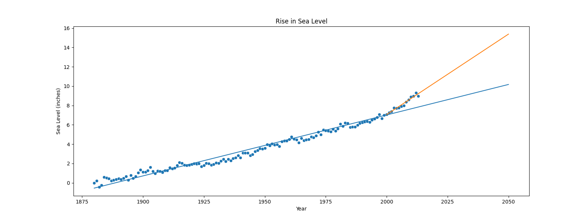

# Sea Level Rise Plot

This repository contains a script that generates a scatter plot of sea level rise data from 1880 to 2050. The data used in the plot is taken from the file "epa-sea-level.csv" and is plotted using the "Year" column as the x-axis and the "CSIRO Adjusted Sea Level" column as the y-axis.

The script also includes the addition of two lines of best fit to the plot. The first line is a linear regression line for the entire dataset, and the second line is a linear regression line for only the data after the year 2000.

The plot is saved as an image file called "sea_level_plot.png".

To run the script, simply run the function `draw_plot()` and make sure the data file "epa-sea-level.csv" is in the same directory as the script.

Dependencies:
- pandas
- matplotlib
- seaborn
- scipy

Make sure you have all these installed in your environment before running the script.

### Example Image

